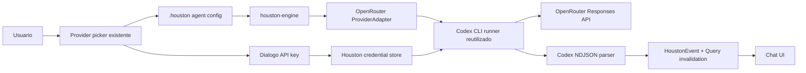

# Plan OpenRouter como nueva suscripcion

## Objetivo

Agregar OpenRouter como nueva conexion seleccionable en Houston, con la misma experiencia actual de proveedores: conectar cuenta, elegir modelo, guardar configuracion por agente, chatear, resumir, compactar y recibir errores visibles. El usuario no debe aprender otra pantalla ni otra logica.

## Decision tecnica

OpenRouter debe entrar como provider `openrouter`, pero debe reutilizar el runner de Codex CLI.

Motivo: Houston ya tiene runner, parser NDJSON, resume, compaction, summarize, provider errors, invalidacion y UI de seleccion para Codex/OpenAI. Un cliente HTTP directo contra OpenRouter duplicaria esa infraestructura y dejaria peor UX.

Contrato probado para Codex CLI:

```text
codex exec \
  -c model_provider="openrouter" \
  -c model_providers.openrouter.name="OpenRouter" \
  -c model_providers.openrouter.base_url="https://openrouter.ai/api/v1" \
  -c model_providers.openrouter.env_key="OPENROUTER_API_KEY" \
  -c model_providers.openrouter.wire_api="responses"
```

No mutar `~/.codex/config.toml`. Houston inyecta config y `OPENROUTER_API_KEY` solo al proceso del agente.

## Estado del repo

- Provider registry vive en `engine/houston-terminal-manager/src/provider/mod.rs`.
- Adaptadores actuales viven en `engine/houston-terminal-manager/src/provider/*.rs`.
- Codex se lanza desde `engine/houston-terminal-manager/src/codex_runner.rs`.
- Args de Codex se construyen en `engine/houston-terminal-manager/src/codex_command.rs`.
- Dispatch de provider vive en `engine/houston-terminal-manager/src/session_dispatch.rs`.
- Parser stdout vive en `engine/houston-terminal-manager/src/session_io.rs` y `codex_parser.rs`.
- Resumen, instrucciones y compactacion viven en `engine/houston-engine-core/src/sessions/`.
- Credenciales tipo API key ya tienen patron en Gemini y OpenRouter
  (`~/.gemini/.env`, `~/.houston/openrouter/.env`).
- Catalogo visual y modelos viven en `app/src/lib/providers.ts`.
- Config por agente usa `ui/agent-schemas/src/config.schema.json`.
- UI de conexion existe en Provider Picker, Provider Settings, Brain Mission y selector de modelo.

## Alcance

1. Nuevo provider id `openrouter`.
2. Credencial Houston-managed para `OPENROUTER_API_KEY`.
3. Reuso de Codex CLI con provider custom por proceso.
4. Modelos OpenRouter seleccionables desde el selector actual.
5. Status, reconnect y errores con provider correcto.
6. Tests Rust y TS para contrato, parser, credenciales y UI.
7. Docs actualizadas en knowledge base.

## Fuera de alcance

- No crear una pantalla paralela de suscripciones.
- No meter OpenRouter en `COMING_SOON`.
- No escribir secrets en `~/.codex/config.toml`.
- No implementar loop HTTP directo a OpenRouter.
- No copiar credenciales entre agentes.
- No romper Claude, OpenAI/Codex ni Gemini.

## Arquitectura propuesta



## Orquestacion de 10 agentes

1. `agent-01-spike-e2e`: valida Codex CLI con OpenRouter custom provider, documenta comandos exactos, confirma error sin key y una prueba real con key.
2. `agent-02-provider-adapter`: crea `openrouter.rs`, registra provider, defaults de modelos y clasificacion de stderr/result.
3. `agent-03-codex-runner`: extiende `codex_command.rs`, `codex_runner.rs` y `session_dispatch.rs` para reusar Codex sin hardcode OpenAI.
4. `agent-04-parser-errors`: cambia parser Codex para atribuir errores a `openrouter`, cubre missing env, 401, 402, 429, 503.
5. `agent-05-credentials`: implementa store, rutas REST, desconexion y permisos de `OPENROUTER_API_KEY`, siguiendo patron Gemini.
6. `agent-06-provider-ux`: adapta dialogs actuales para API-key providers y evita duplicar componentes Gemini.
7. `agent-07-catalog-selection`: agrega OpenRouter a catalogo, logos, modelos, config schema y casts TS.
8. `agent-08-session-defaults`: agrega defaults en summarize, generate instructions, compaction y one-shot provider calls.
9. `agent-09-tests`: agrega pruebas unitarias/integracion, typecheck y regression matrix para providers actuales.
10. `agent-10-docs-qa`: actualiza KBs, prepara checklist manual y revisa que no haya strings sin i18n.

## Fases de implementacion

1. `[engine/provider]` Crear adapter OpenRouter y registry.
2. `[engine/runner]` Hacer Codex runner provider-agnostic para OpenAI y OpenRouter.
3. `[engine/credentials]` Agregar rutas y storage de API key.
4. `[engine/errors]` Clasificar errores con provider correcto.
5. `[app+ui/catalog]` Exponer OpenRouter en seleccion de provider/modelo.
6. `[app/ux]` Reusar conexion API-key provider en settings, picker y onboarding.
7. `[sessions]` Conectar summarize, generate, compact y one-shot defaults.
8. `[tests]` Cubrir adapter, parser, config schema, client y UI.
9. `[docs]` Actualizar KBs y documentar operacion. **Done:** ver
   `knowledge-base/*.md` + `cloud/openrouter-qa-checklist.md`.
10. `[qa]` Probar flujo real: conectar, seleccionar modelo, chat con tool/file,
    reconectar, desconectar. Checklist operator pending en
    `cloud/openrouter-qa-checklist.md`.

## UX esperada

- El usuario ve OpenRouter junto a Claude, Codex y Gemini.
- El usuario pega API key una vez desde el flujo actual de conexion.
- El selector muestra modelos OpenRouter con nombres claros.
- Si falta key, aparece reconnect card con OpenRouter, no OpenAI.
- Si hay quota/rate/auth error, aparece la tarjeta de error actual con mensaje real y report bug.
- Cambiar de suscripcion/modelo no requiere reiniciar la app.

## Archivos esperados

- `engine/houston-terminal-manager/src/provider/openrouter.rs`
- `engine/houston-terminal-manager/src/provider/mod.rs`
- `engine/houston-terminal-manager/src/codex_command.rs`
- `engine/houston-terminal-manager/src/codex_runner.rs`
- `engine/houston-terminal-manager/src/codex_parser.rs`
- `engine/houston-terminal-manager/src/session_dispatch.rs`
- `engine/houston-terminal-manager/src/session_io.rs`
- `engine/houston-terminal-manager/src/cli_process.rs`
- `engine/houston-engine-core/src/provider/openrouter_credentials.rs`
- `engine/houston-engine-core/src/provider/openrouter_disconnect.rs`
- `engine/houston-engine-server/src/routes/providers.rs`
- `ui/engine-client/src/client.ts`
- `ui/engine-client/src/types.ts`
- `ui/agent-schemas/src/config.schema.json`
- `app/src/lib/providers.ts`
- `app/src/data/config.ts`
- `app/src/components/chat-model-selector.tsx`
- `app/src/components/shell/provider-picker.tsx`
- `app/src/components/shell/provider-settings.tsx`
- `app/src/components/shell/provider-error-card.tsx`
- `app/src/components/use-agent-chat-panel.tsx`
- `app/src/components/shell/create-workspace-dialog.tsx`
- `app/src/components/portable/import-wizard.tsx`
- `app/src/components/onboarding/missions/brain.tsx`
- `app/src/locales/en/*.json`
- `app/src/locales/es/*.json`
- `app/src/locales/pt/*.json`
- `knowledge-base/agent-manifest.md`
- `knowledge-base/provider-errors.md`
- `knowledge-base/auth.md`
- `knowledge-base/engine-protocol.md`

## Validacion

```text
cargo test --workspace
cd app && pnpm tsc --noEmit
cd app && pnpm check-locales
pnpm typecheck
```

Prueba manual obligatoria:

1. Conectar OpenRouter con API key real.
2. Crear o editar agente y seleccionar modelo OpenRouter.
3. Enviar mensaje normal.
4. Ejecutar flujo que use archivo o tool.
5. Forzar key invalida y ver error `Unauthenticated` con provider `openrouter`.
6. Forzar quota/rate limit si hay fixture disponible.
7. Desconectar y confirmar que el agente pide reconexion.

## Criterio de listo

OpenRouter queda como conexion real, seleccionable y persistente. Chat, resumen, compaction, errores, reconnect y desconexion funcionan desde la UI existente. No hay credenciales globales, no hay pantalla paralela, y los providers actuales siguen pasando pruebas.
