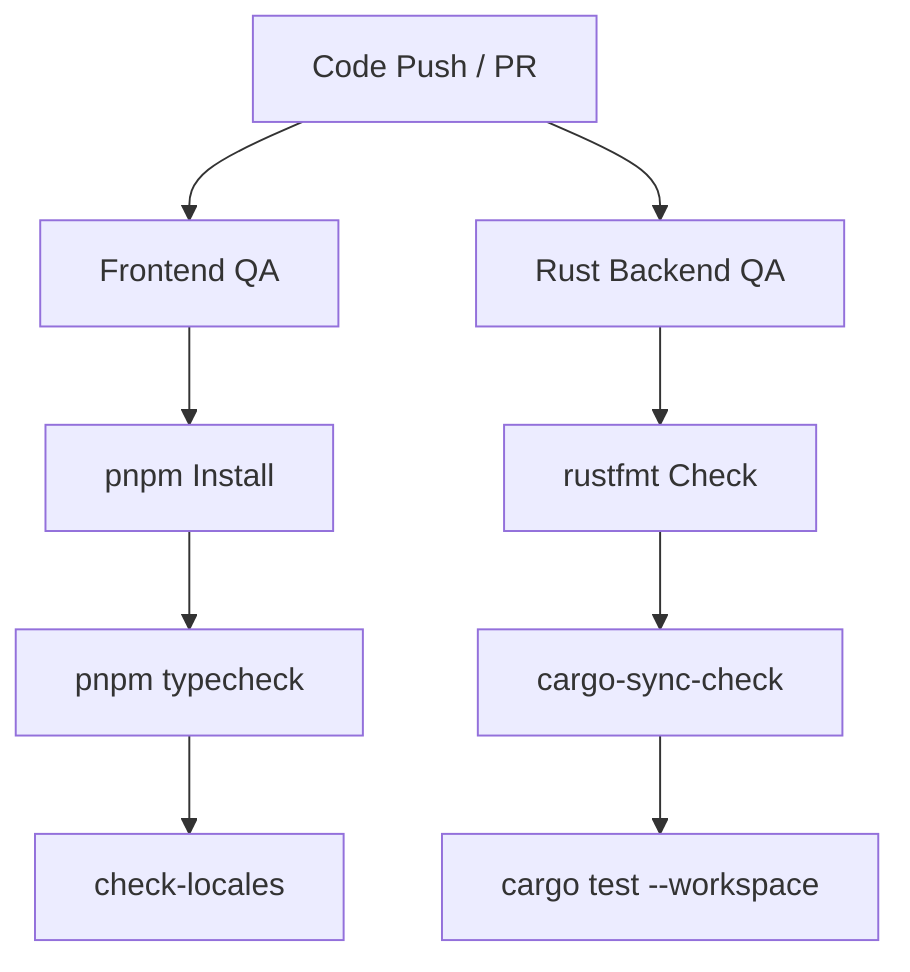

# Quality Assurance & Releases

Houston workspace validation, pre-commit gates, version sync checks, and CI pipeline design.

---

## Pre-Commit Hook Gate

Husky + lint-staged run verification gates before `git commit` executes. Rapid, incremental, local checks.

### Active Stages

- **JS/TS (frontend)**:
  - `pnpm typecheck`: Full type safety validation across 16 workspace projects.
  - `pnpm --filter houston-app check-locales`: JSON schema validation for universal i18n parity (`en`/`es`/`pt`). Blocks em-dashes (`—`).
- **Rust (backend)**:
  - `rustfmt --check`: Standard format consistency on changed `.rs` files.
- **Root/Dependencies**:
  - `scripts/cargo-sync-check.sh`: Verifies workspace synchronization. Triggered when `package.json` undergoes modification.

---

## Crate & Workspace Release Synchronization

To prevent version discrepancies between Rust crates and NPM workspaces:

- **Changesets**: Automates semantic version bumps for NPM React components. Configured at `.changeset/config.json`.
- **Sync Checker (`scripts/cargo-sync-check.sh`)**:
  - Automatically parses root target version from `package.json`.
  - Audits 17 sub-crates' `Cargo.toml` packages and internal workspace dependencies (`houston-*`).
  - Blocks validation if a discrepancy or version drift is detected.

---

## Continuous Integration Pipeline

GitHub Actions `.github/workflows/ci.yml` validates branch integrity on push/PR to `main`.

### Architecture

---

## Makefile Common Targets

Root `Makefile` exposes standardized targets for developers:

- `make typecheck` — TypeScript verification.
- `make check-locales` — Translation audit.
- `make cargo-sync-check` — Cargo version validation.
- `make test` — Rust unit/integration/doc tests.
- `make verify-all` — Full verification sweep. Runs all check targets in sequence.
